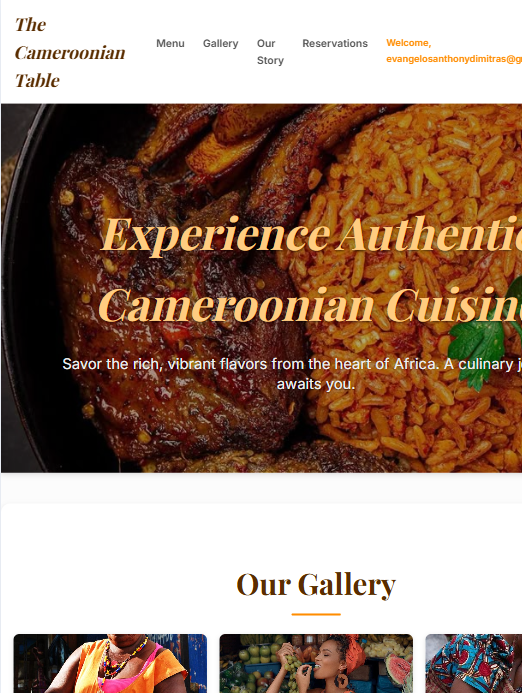

# The Cameroonian Table

A Django web application showcasing authentic Cameroonian cuisine with table reservation functionality.

## Live Application
🌐 **Live Demo:** [the-cameroonian-table-app-38cd3afcabf7.herokuapp.com](https://the-cameroonian-table-app-38cd3afcabf7.herokuapp.com/)

## Project Overview

The Cameroonian Table is a responsive, mobile-first Django website designed to showcase traditional Cameroonian dishes and beverages. The application provides customers with an easy-to-navigate menu system and includes a table reservation feature for booking dining experiences.

## Features

### Current Features
- **Menu Display:** Traditional Cameroonian dishes and drinks organized by categories
- **Table Reservations:** Online reservation system with form validation
- **User Authentication:** Registration and login functionality with django-allauth
- **Admin Panel:** Complete Django admin interface for managing content
- **Responsive Design:** Mobile-first design that works across all devices
- **Hero Section:** Engaging homepage with cultural imagery

### Technologies Used
- **Backend:** Django 4.2.23, Python 3.12
- **Frontend:** HTML5, CSS3, JavaScript
- **Database:** SQLite3 (development), PostgreSQL (production)
- **Deployment:** Heroku with WhiteNoise for static files
- **Authentication:** Django-allauth

## User Stories & Agile Development

### Epic 1: Restaurant Menu Display
1. **As a customer**, I want to view the restaurant menu with prices and descriptions
   - **Status:** Completed

2. **As a customer**, I want to see dishes organized by categories
   - **Status:** Completed

### Epic 2: Table Reservation System
3. **As a customer**, I want to make table reservations online
   - **Status:** Completed

4. **As a restaurant owner**, I want to manage reservations through an admin panel
   - **Status:** Completed

### Epic 3: User Authentication
5. **As a user**, I want to register and login securely
   - **Status:** Completed

6. **As a user**, I want to see my login status
   - **Status:** Completed

## Installation

1. Clone the repository:
```bash
git clone https://github.com/Angel1-coder/the-cameroonian-table-app.git
cd the-cameroonian-table-app
```

2. Create virtual environment:
```bash
python -m venv venv
# Windows
venv\Scripts\activate
# macOS/Linux
source venv/bin/activate
```

3. Install dependencies:
```bash
pip install -r requirements.txt
```

4. Run migrations:
```bash
python manage.py migrate
```

5. Create superuser:
```bash
python manage.py createsuperuser
```

6. Start development server:
```bash
python manage.py runserver
```

## Testing

- **Python Tests:** Model, form, and view tests using Django's testing framework
- **JavaScript Tests:** Frontend functionality including mobile menu and form validation
- **Manual Testing:** Cross-browser compatibility and responsive design verification

## Deployment

The application is deployed on Heroku with automatic deployments from the main branch.

**Live URL:** https://the-cameroonian-table-app-38cd3afcabf7.herokuapp.com/

## Screenshots

### Desktop View

*Homepage showing hero section and menu*


*Table reservation form*

### Tablet View

*Responsive design for tablet*

### Mobile View

*Mobile-optimized interface*

## Author

Evangelos Anthony Dimitras
GitHub: [Angel1-coder](https://github.com/Angel1-coder)